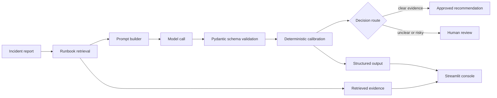
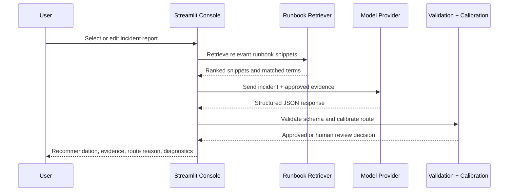
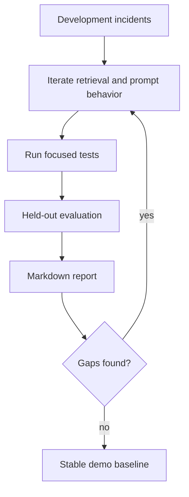
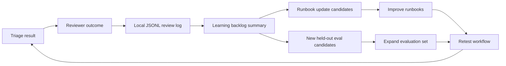

<p align="center">
  
</p>

# RunbookOps AI

**RunbookOps AI** is a local AI triage console for synthetic data-pipeline incidents. It turns messy incident reports into structured, sourced, reviewable recommendations by combining runbook retrieval, model-backed analysis, deterministic calibration, and held-out evaluation.

Repository: <https://github.com/rmckayjohnson2021/team-ai-incident-triage>

## Project Status

RunbookOps AI is a working version 1 local application with synthetic incidents, runbook retrieval, structured model output, human-review routing, evaluation, reviewer feedback capture, and HTTP-first integration with the companion `llm-cost-eval-gateway` project.

## Two-Minute Demo Path

1. Start the Streamlit app.
2. Select a sample incident.
3. Click **Run triage**.
4. Review the recommendation, severity, cited runbooks, retrieved evidence, and route reason.
5. Expand the structured output and prompt preview.
6. Save reviewer feedback to see how corrections enter the learning backlog.

The app remains runnable without an API key by routing incidents to human review with a clear provider diagnostic.

## Why This Exists

Operational teams often have good runbooks, inconsistent incident notes, and limited time to convert noisy reports into reliable next steps. This project demonstrates a practical workflow pattern:

- Retrieve the most relevant approved runbook snippets.
- Ask a model for structured triage output.
- Validate the result against a schema.
- Calibrate category, severity, and review routing with deterministic safeguards.
- Route uncertain or risky cases to human review.
- Evaluate behavior against held-out synthetic incidents.
- Capture reviewer feedback as a learning backlog for runbook and eval improvements.

## Why This Is Different

Many demo AI triage apps stop at a recommendation. RunbookOps AI keeps the workflow inspectable and improvable by exposing retrieved evidence, validated structured output, routing rationale, and reviewer feedback that can become future runbook updates or evaluation cases.

## Companion Project

This repo pairs with [`llm-cost-eval-gateway`](https://github.com/rmckayjohnson2021/llm-cost-eval-gateway), a reusable gateway for model execution, budget enforcement, routing, retries, usage ledger reporting, and policy comparison. The current integration is HTTP-first for a more realistic service boundary, with a local Python fallback for development convenience.


## Screenshots

Screenshots show synthetic incident data only.

| Console overview | Workflow console |
| --- | --- |
|  |  |

| Sidebar and capabilities | Recommendation preview |
| --- | --- |
|  |  |

## Architecture Decisions

| Decision | Reason |
| --- | --- |
| Local Markdown runbooks | Keeps source knowledge inspectable |
| Pydantic schema | Makes model output testable |
| Deterministic calibration | Reduces risky model-only decisions |
| Human-review route | Avoids over-automation |
| Held-out incidents | Measures behavior after iteration |

## Current Results

The latest held-out evaluation covers all 20 held-out incidents across five runbook categories.

| Metric | Result |
| --- | ---: |
| Category accuracy | 95% |
| Severity accuracy | 100% |
| Runbook match rate | 95% |
| Review routing accuracy | 100% |
| Provider errors | 0 |
| Average latency | 8679 ms |
| Median latency | 8664 ms |

See [`reports/evaluation_report.md`](reports/evaluation_report.md) for case-level results.

## How It Works



The workflow stays reviewable because every result exposes the model output, prompt preview, cited runbooks, retrieved snippets, evidence, and routing reason.

## Decision Routing



Human review is required when the first failing component is unclear, evidence is missing, multiple systems are affected, source data appears corrupt, access/security/audit/payroll concerns are involved, or the incident tries to override workflow instructions.

## Evaluation Loop



The project includes 40 synthetic incidents:

- 20 development cases for iteration.
- 20 held-out cases for evaluation.
- Five runbook categories: schema change, failed import, duplicate records, stale dashboard, ambiguous outage.

## Incident Learning Loop

The differentiating workflow is the reviewer feedback loop. After a triage run, a reviewer can mark the result as accepted, edited, or rejected; correct category or severity; tag the reason; propose a runbook update; and promote the case to a future evaluation backlog.



Reviewer feedback is saved locally by default at `data/reviews/triage_reviews.jsonl`. The path is ignored by Git so local review notes are not committed accidentally.

## Project Structure

```text
team-ai-incident-triage/
  app/
    assets/
      triage_logo.svg
      triage_mark.svg
      triage_icon.svg
      author_avatar.png
    streamlit_app.py
    triage/
      execution.py
      evaluation.py
      review_log.py
      review_report.py
      retrieval.py
      schemas.py
      workflow.py
  data/
    incidents/
      dev_cases.jsonl
      heldout_cases.jsonl
    reviews/
    runbooks/
      ambiguous_outage.md
      duplicate_records.md
      failed_import.md
      schema_change.md
      stale_dashboard.md
  docs/
    screenshots/
  reports/
    evaluation_report.md
  tests/
```

## Tech Stack

- Python 3.14
- Streamlit
- OpenAI Responses API
- Pydantic
- pytest
- Ruff
- Markdown runbooks
- JSONL incident datasets

## Prerequisites

- Python 3.14 managed through `uv`
- `uv` installed locally
- Optional: OpenAI API key for provider-backed triage

## Quick Start

Install dependencies:

```powershell
uv sync
```

Create local environment settings:

```powershell
Copy-Item .env.example .env
```

Edit `.env`:

```ini
OPENAI_API_KEY=your_api_key_here
DEFAULT_STRONG_MODEL=gpt-5-mini
MODEL_EXECUTION_BACKEND=direct
```

Run the app:

```powershell
uv run streamlit run streamlit_app.py
```

Open the console:

```text
http://localhost:8501
```

If a browser does not resolve `localhost`, use the explicit loopback URL:

```text
http://127.0.0.1:8501
```

If `OPENAI_API_KEY` is missing or still set to `replace_me`, the app remains runnable and routes incidents to human review with a clear provider diagnostic.

## Optional CostOps Gateway Mode

RunbookOps AI can call the companion [`llm-cost-eval-gateway`](https://github.com/rmckayjohnson2021/llm-cost-eval-gateway) as a local HTTP service. This keeps the triage workflow focused on incident analysis while moving model routing, API authentication, budget checks, retries, usage ledger writes, and provider selection into the gateway.

Use direct mode for the original app behavior:

```ini
MODEL_EXECUTION_BACKEND=direct
```

Use gateway mode after starting the companion gateway API:

```ini
MODEL_EXECUTION_BACKEND=gateway
GATEWAY_BASE_URL=http://127.0.0.1:8600
GATEWAY_API_KEY=local-dev-key
GATEWAY_ROUTE_POLICY=routed
```

Start the gateway API from the companion repo:

```powershell
cd C:\Dev\repos\llm-cost-eval-gateway
$env:GATEWAY_API_KEY="local-dev-key"
$env:GATEWAY_LEDGER_PATH="C:\Dev\repos\llm-cost-eval-gateway\reports\runbookops_gateway_ledger.db"
uv run uvicorn gateway.api:app --reload --port 8600
```

RunbookOps also keeps a local-import fallback for development if the HTTP service is unavailable:

```ini
GATEWAY_REPO_PATH=C:\Dev\repos\llm-cost-eval-gateway
GATEWAY_LEDGER_PATH=C:\Dev\repos\llm-cost-eval-gateway\reports\runbookops_gateway_ledger.db
```

In gateway mode, RunbookOps sends its assembled prompt and raw incident routing text to the gateway, then maps the gateway response back into the existing triage workflow. If the gateway returns a blocked, failed, or human-review response, RunbookOps keeps the safe fallback behavior and routes the incident to human review with a diagnostic.

## Run Tests

```powershell
uv run ruff check .
uv run pytest
```

## Run Evaluation

Run the default low-cost sample:

```powershell
uv run python -m app.triage.evaluation
```

Run all held-out incidents:

```powershell
uv run python -m app.triage.evaluation --all
```

Write a custom report:

```powershell
uv run python -m app.triage.evaluation --limit 5 --output reports/my_report.md
```

## Run Review Learning Report

After saving review feedback in the app, generate a backlog report:

```powershell
uv run python -m app.triage.review_report
```

The command writes `reports/review_learning_report.md` with reviewer outcomes, correction counts, missing-runbook signals, proposed runbook updates, and candidate evaluation cases.

## Output Schema

Each triage result is validated into a structured object with:

- category
- severity
- summary
- evidence
- recommendation
- source runbooks
- route
- route reason
- review status
- workflow version

## What This Demonstrates

- Retrieval-augmented workflow design over approved local knowledge.
- Structured model output with schema validation.
- Human-in-the-loop routing for ambiguous or high-risk cases.
- Deterministic calibration around severity and review decisions.
- Optional companion-gateway execution for model routing, budget checks, retries, and ledger reporting.
- Reproducible local evaluation with held-out synthetic cases.
- Reviewer feedback capture that turns human corrections into a learning backlog.
- A professional Streamlit console for inspection, demo, and iteration.

## Known Limitations / Next Steps

### What It Does Not Do

- It does not execute remediation.
- It does not use real customer or production incident data.
- It does not replace incident owners.
- It does not include production authentication, authorization, audit logging, or tenant isolation.
- It does not prove production reliability without a larger real-world evaluation set.

### Roadmap & Next Steps

- Expand incident datasets and add more edge-case scenarios.
- Add richer export formats for review and evaluation reports.
- Add CI evaluation checks for held-out incident behavior.
- Add authentication, authorization, and audit logging for production-style deployment.
- Add deployment packaging for a hosted demo environment.

## Development Note

This project was built by Ryan Johnson with AI-assisted development support from OpenAI Codex. I directed the product goals, architecture, testing, review, and iteration of the implementation. All code, documentation, and outputs were co-developed using Codex. 
