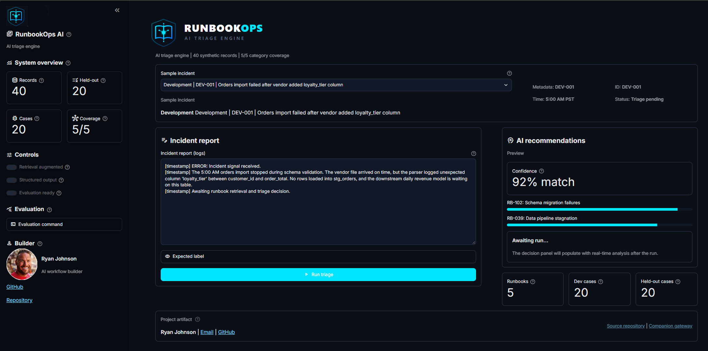
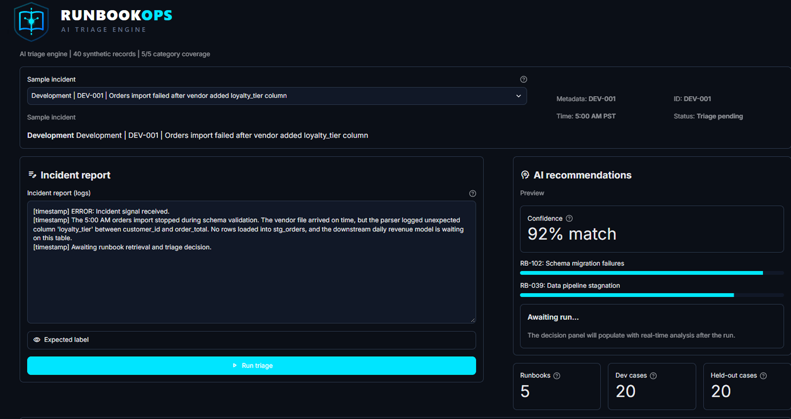
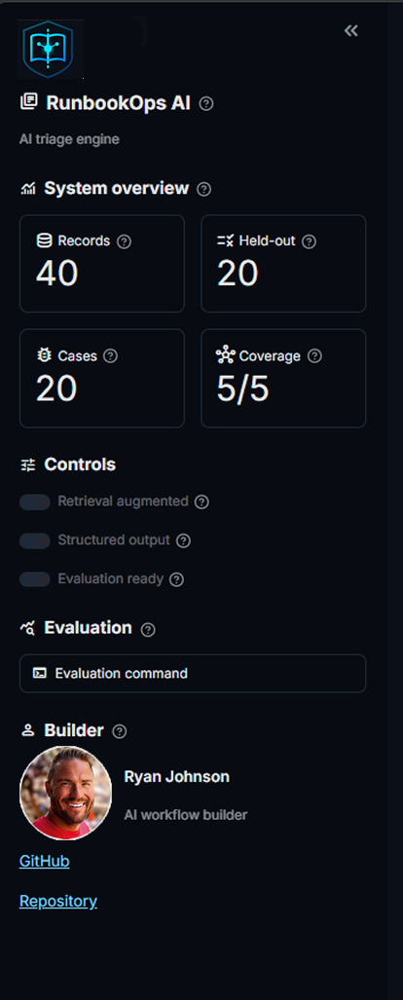
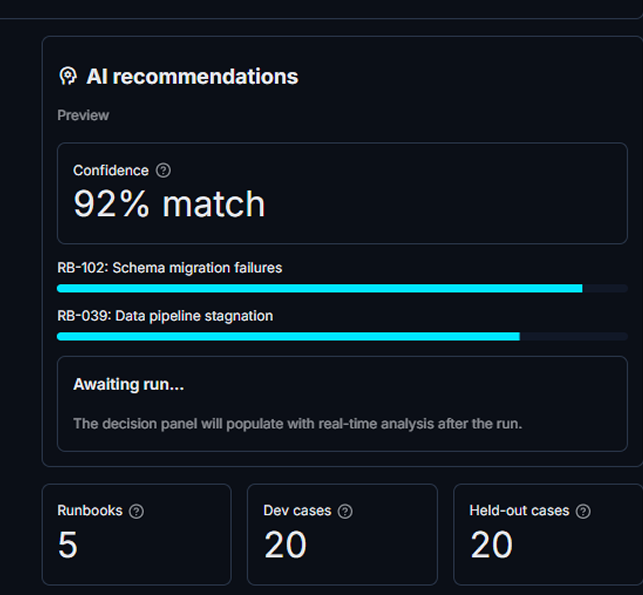
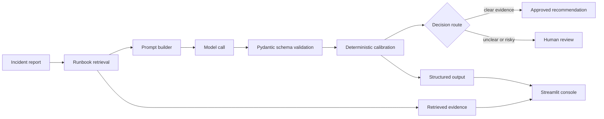
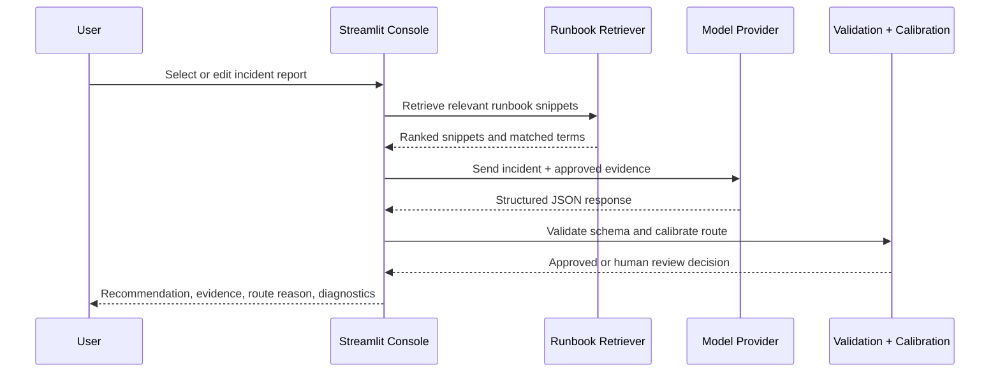
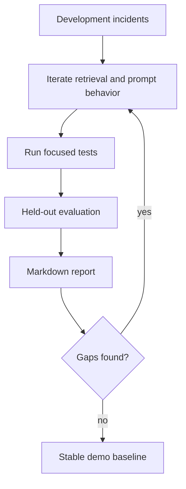
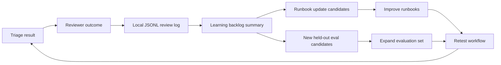

<p align="center">
  
</p>

# RunbookOps AI

**RunbookOps AI** is a local AI triage console for synthetic data-pipeline incidents. It turns messy incident reports into structured, sourced, reviewable recommendations by combining runbook retrieval, model-backed analysis, deterministic calibration, and held-out evaluation.

Repository: <https://github.com/rmckayjohnson2021/team-ai-incident-triage>

## Why This Exists

Operational teams often have good runbooks, inconsistent incident notes, and limited time to convert noisy reports into reliable next steps. This project demonstrates a practical workflow pattern:

- Retrieve the most relevant approved runbook snippets.
- Ask a model for structured triage output.
- Validate the result against a schema.
- Calibrate category, severity, and review routing with deterministic safeguards.
- Route uncertain or risky cases to human review.
- Evaluate behavior against held-out synthetic incidents.
- Capture reviewer feedback as a learning backlog for runbook and eval improvements.

## Screenshots

| Console overview | Workflow console |
| --- | --- |
|  |  |

| Sidebar and controls | Recommendation preview |
| --- | --- |
|  |  |

## Current Results

The latest held-out evaluation covers all 20 held-out incidents across five runbook categories.

| Metric | Result |
| --- | ---: |
| Category accuracy | 95% |
| Severity accuracy | 100% |
| Runbook match rate | 95% |
| Review routing accuracy | 100% |
| Provider errors | 0 |
| Average latency | 8679 ms |
| Median latency | 8664 ms |

See [`reports/evaluation_report.md`](reports/evaluation_report.md) for case-level results.

## How It Works



The workflow stays reviewable because every result exposes the model output, prompt preview, cited runbooks, retrieved snippets, evidence, and routing reason.

## Decision Routing



Human review is required when the first failing component is unclear, evidence is missing, multiple systems are affected, source data appears corrupt, access/security/audit/payroll concerns are involved, or the incident tries to override workflow instructions.

## Evaluation Loop



The project includes 40 synthetic incidents:

- 20 development cases for iteration.
- 20 held-out cases for evaluation.
- Five runbook categories: schema change, failed import, duplicate records, stale dashboard, ambiguous outage.

## Incident Learning Loop

The differentiating workflow is the reviewer feedback loop. After a triage run, a reviewer can mark the result as accepted, edited, or rejected; correct category or severity; tag the reason; propose a runbook update; and promote the case to a future evaluation backlog.



Reviewer feedback is saved locally by default at `data/reviews/triage_reviews.jsonl`. The path is ignored by Git so local review notes are not committed accidentally.

## Project Structure

```text
team-ai-incident-triage/
  app/
    assets/
      triage_logo.svg
      triage_mark.svg
      triage_icon.svg
      author_avatar.png
    streamlit_app.py
    triage/
      execution.py
      evaluation.py
      review_log.py
      review_report.py
      retrieval.py
      schemas.py
      workflow.py
  data/
    incidents/
      dev_cases.jsonl
      heldout_cases.jsonl
    reviews/
    runbooks/
      ambiguous_outage.md
      duplicate_records.md
      failed_import.md
      schema_change.md
      stale_dashboard.md
  docs/
    screenshots/
  reports/
    evaluation_report.md
  tests/
```

## Tech Stack

- Python 3.14
- Streamlit
- OpenAI Responses API
- Pydantic
- pytest
- Ruff
- Markdown runbooks
- JSONL incident datasets

## Quick Start

Install dependencies:

```powershell
uv sync
```

Create local environment settings:

```powershell
Copy-Item .env.example .env
```

Edit `.env`:

```ini
OPENAI_API_KEY=your_api_key_here
DEFAULT_STRONG_MODEL=gpt-5-mini
```

Run the app:

```powershell
uv run streamlit run streamlit_app.py
```

Open the console:

```text
http://localhost:8501
```

If a browser does not resolve `localhost`, use the explicit loopback URL:

```text
http://127.0.0.1:8501
```

If `OPENAI_API_KEY` is missing or still set to `replace_me`, the app remains runnable and routes incidents to human review with a clear provider diagnostic.

## Run Tests

```powershell
uv run ruff check .
uv run pytest
```

## Run Evaluation

Run the default low-cost sample:

```powershell
uv run python -m app.triage.evaluation
```

Run all held-out incidents:

```powershell
uv run python -m app.triage.evaluation --all
```

Write a custom report:

```powershell
uv run python -m app.triage.evaluation --limit 5 --output reports/my_report.md
```

## Run Review Learning Report

After saving review feedback in the app, generate a backlog report:

```powershell
uv run python -m app.triage.review_report
```

The command writes `reports/review_learning_report.md` with reviewer outcomes, correction counts, missing-runbook signals, proposed runbook updates, and candidate evaluation cases.

## Output Schema

Each triage result is validated into a structured object with:

- category
- severity
- summary
- evidence
- recommendation
- source runbooks
- route
- route reason
- review status
- workflow version

## What This Demonstrates

- Retrieval-augmented workflow design over approved local knowledge.
- Structured model output with schema validation.
- Human-in-the-loop routing for ambiguous or high-risk cases.
- Deterministic calibration around severity and review decisions.
- Reproducible local evaluation with held-out synthetic cases.
- Reviewer feedback capture that turns human corrections into a learning backlog.
- A professional Streamlit console for inspection, demo, and iteration.

## What It Does Not Do

- It does not execute remediation.
- It does not use real customer or production incident data.
- It does not replace incident owners.
- It does not include production authentication, authorization, audit logging, or tenant isolation.
- It does not prove production reliability without a larger real-world evaluation set.

## Companion Project

This repo is designed to pair with [`llm-cost-eval-gateway`](https://github.com/rmckayjohnson2021/llm-cost-eval-gateway), a reusable gateway for model execution, budget enforcement, routing, retries, and evaluation.
